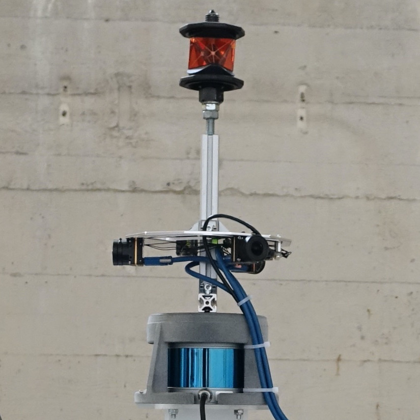

# Self-Improving Semantic Perception for Indoor Localisation


This repository contains the code used on our self-improving robot, as well as links to all the data and configs to reproduce our results.

# Review
Below you can find instructions to run parts of our code and reproduce results.

In order to read and verify our implementations, these are the most important files:

- Training is implemented in `src/train_binary_segmodel_base.py` based on the model implementation in `src/bfseg/cl_models/base_cl_model.py`.
- Online learning is implemented in `src/online_learning.py`.
- Pseudo labels are generated by processing first in `src/dataset_creator.cpp` and then aggregation in `src/label_aggregator.py`.
- The full system overview can be seen from `launch/paper_experiments/pickelhaube2_segmentation.launch` (segmentation+localisation),  `launch/paper_experiments/pickelhaube2_full.launch`(localisation+pseudolabels), and `launch/paper_experiments/pickelhaube2_online_learning.launch`(segmentation+localisation+pseudolabels+training).

# Installation
The software was developed under ubuntu 18.04 and ROS melodic.
It is organized as a hybrid ROS and python workspace. Localisation experiments and online learning are running in the ROS workspace. Segmentation training and evaluation are running in the python-only workspace. Please follow the respective instructions below to set up the different workspaces.

## Installing the ROS workspace
The ROS workspace requires some of dependencies that could be too clearly linked to the authors of this work. After discussing with the conference chairs, they informed us that we should therefore remove any link to these dependencies, at the cost of enabeling the reviewers to run our code. To cite the chairs: "It is precisely a scenario like this that we did not include runnable code as a review criteria."

Of course, the dependencies and installation instructions for the ROS workspace will be made available upon acceptance.

## Installing the python workspace
### Create virtualenv
Use your favourite way to create a python environment. We recommend one of these:

```bash
mkvirtualenv background_foreground_segmentation --python=$(which python3)
```

```bash
python3 -m venv py3_venv
```

### Install dependencies
Letting `$BFSEG_ROOT` be the folder of this repo (i.e., where this README is located), assuming the virtualenv created above is always sourced:
- Install required dependencies:
  ```bash
  cd $BFSEG_ROOT
  pip install -r requirements.txt
  ```
- Install Python package in this repo:
  ```bash
  cd $BFSEG_ROOT/src
  pip install -e .
  ```

### Load Datasets
For training and evaluation, some datasets are required. We use [TFDS](https://www.tensorflow.org/datasets) to automatically download and extract these datasets. This will require around 50GB and can take a couple of hours to prepare.

```bash
cd $BFSEG_ROOT
python data_setup.py
```

### Configure Settings
create a file `src/bfseg/settings.py` with the following content:
```python
TMPDIR = '/tmp'  # a temporary storage folder
EXPERIMENT_STORAGE_FOLDER = '<insert here>' # a folder where training logs should be stored
```

# Reproducing Experiments

## Experimental setup
We perform experimentation on a mobile robot that we deploy in three different environments, i.e. a garage, an office, and a construction site. The robot is equipped with a 3D LiDAR sensor and three cameras in a 360° horizontal configuration. For reference, the robot's ground-truth position is tracked using a prism and an external tracking station.


<em>Sensor setup on mobile robot</em>

## Rosbag Download
Each localisation experiment requires a different bagfile with recorded sensor readings. Since each bagfile has 20-30 GB, we do not have a script that downloads all bagfiles in advance. Please download the bagfiles you need to a directory of choice and either

- provide the location of the downloaded bagfiles as an argument:
```bash
roslaunch background_foreground_segmentation <experiment>.launch rosbag_folder:=/your/rosbag/location
```
- OR link the folder once into the workspace
```bash
ln -s /your/rosbag/location $BFSEG_ROOT/rosbags
```
The bagfiles are listed in `rosbags.md`.
## Examples for localization experiments

Use an example bagfile (**Garage1**): [download bagfile](https://drive.google.com/file/d/1bVjDkZkycKaDUXlDpqKvr6hIjR4oC8ng/view?usp=sharing)

**Localisation without Segmentation**
```bash
roslaunch background_foreground_segmentation pickelhaube_full_garage1.launch
```
**Localisation with NYU-pretrained weights**
```bash
roslaunch background_foreground_segmentation pickelhaube_nyusegmentation_garage1.launch
```
**Localisation with Segmentation model trained in same environment (not on same dataset)**
```bash
roslaunch background_foreground_segmentation pickelhaube_segmentation_garage1.launch
```

**Localisation with Segmentation model trained first on Office and then on Garage**

localising in the Garage on a different trajectory:
```bash
roslaunch background_foreground_segmentation crossdomain_nyutoofficetocla_garage3.launch
```

localising in the Office (to measure forgetting):
```bash
roslaunch background_foreground_segmentation crossdomain_nyutoofficetocla_office7.launch
```

## Evaluation of Localised Trajectories
When running the experiments as above, poses from the ground-truth (leica) and the robot (icp) are recorded in the `$BFSEG_ROOT/logs` directory. To get the localisation accuracy, use the following script to interpolate the leica pose to the timestamps of the icp localisation:

```python
import pandas as pd
import numpy as np
import scipy as sp
import scipy.interpolate
import scipy.spatial.transform as stf
import matplotlib.pyplot as plt

icp = pd.read_csv('logs/pickelhaube_full_garage1_icp_<set correct number>.csv')
leica = pd.read_csv('logs/pickelhaube_full_garage1_leica_<set correct number>.csv')
plt.figure()
plt.plot(icp['trans_x'], icp['trans_y'])
plt.plot(-leica['trans_y'], leica['trans_x'])
plt.show()
# interpolate with calibrated time-offset
interpolated_gt_x = sp.interpolate.interp1d(
    leica['headerstamp']  + 4.5e8, leica['aligned_x'],
    bounds_error=False, fill_value=np.nan)
interpolated_gt_y = sp.interpolate.interp1d(
    leica['headerstamp']  + 4.5e8, leica['aligned_y'],
    bounds_error=False, fill_value=np.nan)

icp['gt_trans_x'] = interpolated_gt_x(icp['headerstamp'])
icp['gt_trans_y'] = interpolated_gt_y(icp['headerstamp'])
icp['rmse_xy'] = np.sqrt(
    np.square(icp['trans_x'] - icp['gt_trans_x']) +
    np.square(icp['trans_y'] - icp['gt_trans_y']))
icp.plot('headerstamp', 'rmse_xy')
print('Mean: {:.3f}, Median: {:.3f}, Std: {:.3f}'.format(icp['rmse_xy'].mean(), icp['rmse_xy'].median(), icp['rmse_xy'].std()))
```

## Getting the Pseudolabels
Each run with `pickelhaube_full_*.launch` will automatically store a dataset of pseudolabels in `$BFSEG_ROOT/logs/pickelhaube_full*/`. You can load the dataset into tensorflow like this:

```python
from bfseg.data.fsdata import load_fsdata
import tensorflow as tf
import os
import json
datapath = '$BFSEG_ROOT/logs/pickelhaube_full*/'
if not os.path.exists(os.path.join(datapath, 'dataset_info.json')):
    with open(os.path.join(datapath, 'dataset_info.json'), 'w') as f:
        json.dump({
            'output_shapes': {'rgb': [None, None, 3], 'labels': [None, None]},
            'output_types': {'rgb': 'float32', 'labels': 'int32'}
        }, f)
ds = load_fsdata(datapath)
# visualize
import matplotlib.pyplot as plt
for blob in ds.shard(10, 0).take(10).as_numpy_iterator():
    _, axs = plt.subplots(1, 2, figsize=(10, 5))
    axs[0].imshow(blob['rgb'] / 255)
    axs[1].imshow(blob['labels'])
```

Alternatively, you can load already created pseudolabels that we used for our experiments:
```python
import bfseg.data.pseudolabels
import bfseg.data.meshdist.bfseg_cla_meshdist_labels
import tensorflow_datasets as tfds

ds = tfds.load('meshdist_pseudolabels', split='rumlang3')  # for construction
ds = tfds.load('meshdist_pseudolabels', split='office5')  # for office
ds = tfds.load('bfseg_cla_meshdist_labels')  # for garage
```

## Running Trainings

We use the [sacred library](https://github.com/IDSIA/sacred) to organize our training scripts and log results. You can start a training e.g. with
```bash
python src/train_binary_segmodel_base.py with /path/to/config.yaml --name "my training"
```
The results like model snapshots and metrics are then stored in the directory set in `src/bfseg/settings.py` (see Installation).

You may also use the pre-trained models or the config files used to obtain these (see [`pretrained_models_and_configs.md`](pretrained_models_and_configs.md)).

## Online Learning
The paper experiment was conducted on bagfile [Rumlang1](https://drive.google.com/file/d/1uJQkurwowBo5NmOd9aCYqvV2wDAx2FHs/view?usp=sharing).

For online learning we rely on simultaneously executing nodes in python2 and python3, so in case you encounter import errors make sure to install the dependencies to both python versions.

```bash
roslaunch background_foreground_segmentation pickelhaube_online_learning_rumlang1.launch
```

# Software Overview

The repository is structured in the following way:

- `src/` contains ROS nodes, including
  - `src/dataset_creator.cpp`: measures distance between lidar points and mesh, projects into the camera images
  - `src/cloud_filtering_node`: filters the pointcloud according to segmentation outputs from the cameras
  - `src/inference_node.py`: runs inference of a trained network on the camera images and publishes segmentation maps
  - `src/label_aggregator.py`: runs superpixel oversegmentation and uses the output of `src/dataset_creator.cpp` to generate the pseudolabels
  - `src/online_learning.py`: runs online inference, training and pseudolabel generation
- `src/` also contains training scripts:
  - `src/train_binary_segmodel_base.py`: training with/without memory replay
  - `src/train_binary_segmodel_distillation.py`: training with distillation based methods
  - `src/train_binary_segmodel_EWC.py`: training with EWC
- `src/bfseg/` is the python library used for both parts.
  - `src/bfseg/data/` contains loaders for datasets
  - `src/bfseg/cl_models/` implements continual-learning models
  - `src/bfseg/models/` contains the fast-scnn network architecture
  - `src/bfseg/utils/` contains helpers for image augmentation, superpixel segmentation, losses, metrics and factory functions

## Dataset Creator
## Overview
This package extracts the following information from a ROS Bag:

- For each camera:
    - Camera information (All information from the Sensor Message)
    - For each camera frame:
        - Timestamp
        - Camera pose in map as 4x4 Matrix [T_map_camera]
        - Camera Image
        - Point cloud in camera frame (as .pcd file, xyzi, where i is distance to mesh in mm)
        - Projected PointCloud in camera image (Only point cloud)
        - Projecctted PointCloud in camera image containing distance of point as grey value
        - Projecctted PointCloud in camera image containing distance to closest mesh as grey value


## Continual learning

### Overview

#### Dataset

- [NYU Depth Dataset V2](https://cs.nyu.edu/~silberman/datasets/nyu_depth_v2.html)
- Meshdist Dataset (our dataset generated by auto-labeling)
- Hive Dataset (with ground truth, for validation)

#### Methods

We implement the following methods for continual learning:

- Fine tuning (baseline)
- Feature distillation
- Output distillation
- [EWC](https://arxiv.org/pdf/1612.00796.pdf)
